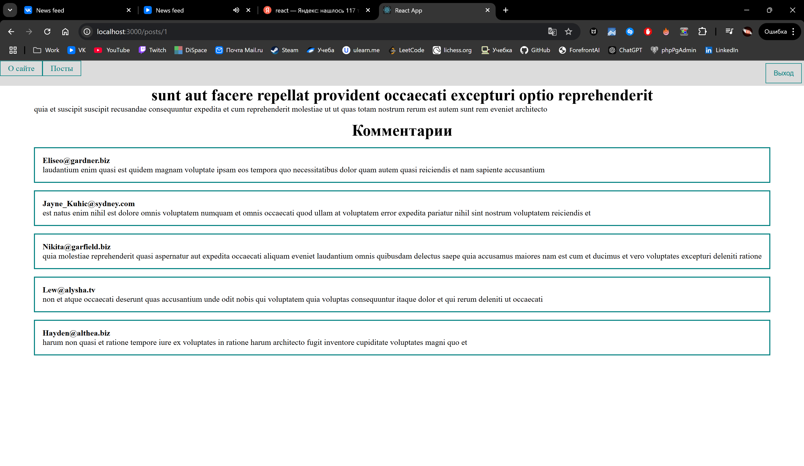

# PostManager - React App

**PostManager** is a simple React application that allows you to fetch, view, sort, add, and delete posts. The app integrates with an API to display posts and provides features for efficient content management.

---

## 1. Main Page

The main page displays a list of posts fetched from the API. Users can sort the posts by different criteria, and the list is updated accordingly. You can also add new posts or delete existing ones.

---

## 2. Modal Window

The modal window appears when you want to add a new post. It contains input fields to enter the post title and content. Once the data is entered, you can submit the form to add the post to the list.

---

## 3. Post View

Clicking on a post allows you to view its detailed content. This view includes the full title and body of the post, giving you more context about the post's content.

---

### Features

- Fetch and display posts from an API.
- Sort posts by various criteria.
- Add and delete posts from the list.
- View detailed content of individual posts.